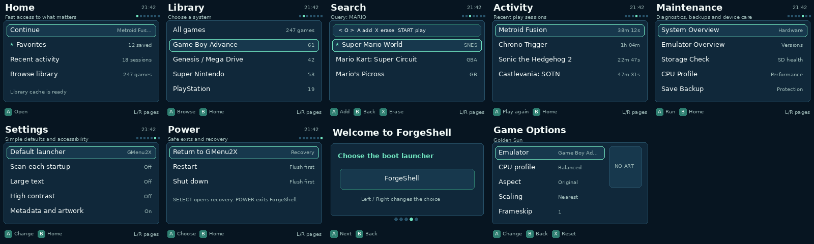

# ForgeOS

ForgeOS is a portable, controller-first launcher and firmware integration layer
for small Linux handhelds. **ForgeShell** provides a lightweight SDL 1.2
interface for libraries, search, favorites, play history, metadata, per-game
options, maintenance, onboarding, safe mode, and recovery.

The **Powkiddy Q90** is the reference full-firmware target. ForgeOS keeps the
MiyooCFW bootloader, kernel, drivers, Buildroot packages, and emulator patches,
while supplying a fresh launcher and a safer maintenance/recovery experience.
GMenu2X remains installed as the fallback frontend.

> **Beta software:** use a spare microSD card, keep the original card unchanged,
> and read [HARDWARE-TEST.md](HARDWARE-TEST.md) before relying on the image.



## Highlights

- One coherent **Midnight Mint** theme across every ForgeShell page and console panel.
- Portable device profiles for display, storage, controls, labels, power, and capabilities.
- GMenu2X and portable `systems.ini` emulator providers.
- Duplicate-free ROM scanning, nested folders, caching, search, favorites, and activity history.
- Per-game emulator, CPU, aspect, scaling, frameskip, and BIOS overrides.
- Atomic state writes, safe mode, last-known-good settings, and automatic recovery.
- Transactional themes and strict device/emulator/tool manifests that fail safely.
- Built-in diagnostics, storage checks, save backups, performance controls, and test reports.
- Reproducible Q90 builds pinned to a known MiyooCFW Buildroot revision.
- GitHub Actions for validation, simulator builds, Q90 images, checksums, attestations, and releases.

## Downloading a release

GitHub releases contain these principal assets:

| Asset | Purpose |
|---|---|
| `forgeos-q90-<version>.img.xz` | Compressed full Q90 SD-card image |
| `forgeos-q90-<version>.img.emulators.txt` | Exact emulator package/revision manifest |
| `q90-forgeos-<version>-sd-overlay.zip` | Maintenance-only update for an existing card |
| `forgeos-<version>-source.zip` | Reproducible source snapshot |
| `SHA256SUMS` | Integrity checks for every release asset |

The SD overlay **does not install ForgeShell or update emulators**. Use the full
image for the complete firmware.

## Build the Q90 image

A Linux host is required. Install the packages listed in
[`docs/BUILDING.md`](docs/BUILDING.md), then run:

```sh
./forge-build q90 --check
./forge-build q90
```

Outputs are written to `dist/`. The build downloads the pinned MiyooCFW tree,
injects ForgeShell as a Buildroot package, installs the Q90 adapter, and produces
an image, checksum, upstream revision, and emulator manifest.

## Validate the project

```sh
python3 tools/validate-platform.py
python3 tools/validate-theme.py
./forge-build q90 --check
./forge-build generic-linux --check
./tests/run.sh
```

To test the desktop simulator:

```sh
./forge-build generic-linux
./tools/run-simulator.sh --resolution 480x272 --fake-battery 72
```

## Port ForgeOS to another handheld

```sh
python3 tools/new-platform.py my-device \
  --name "My Device" --resolution 640x480 --provider forge-manifest
```

Device-specific code belongs under `platforms/<device>/`; shared library, UI,
metadata, search, favorites, and recovery logic remain in ForgeShell. See
[`docs/PORTING.md`](docs/PORTING.md) and
[`docs/PLATFORM-SCHEMA.md`](docs/PLATFORM-SCHEMA.md).

## Repository layout

```text
src/forgeshell/       portable C/SDL launcher
platforms/q90/        Q90 adapter and pinned Buildroot metadata
platforms/generic-linux/ desktop simulator adapter
overlay/               files installed into a full Q90 image
sd-overlay/            update-safe maintenance overlay
tools/                 build, packaging, validation, and release tooling
tests/                 sanitizer, integration, portability, and packaging tests
.github/workflows/     CI, Q90 image, and tagged-release automation
```

## Releasing

Maintainers create a release by updating `VERSION` and `CHANGELOG.md`, merging a
clean CI run, and pushing an annotated tag matching `v$(cat VERSION)`:

```sh
git tag -a "v$(cat VERSION)" -m "ForgeOS $(cat VERSION)"
git push origin "v$(cat VERSION)"
```

The release workflow validates the tag, runs the complete test suite, builds the
Q90 image, packages compressed assets, verifies `SHA256SUMS`, generates a GitHub
artifact attestation when supported, and publishes a GitHub **prerelease**.
See [`docs/RELEASING.md`](docs/RELEASING.md) and [`docs/GITHUB-SETUP.md`](docs/GITHUB-SETUP.md).

## Legal and support

ForgeOS contains no commercial ROMs or proprietary BIOS files. Third-party
components retain their upstream licenses; see [THIRD_PARTY.md](THIRD_PARTY.md).
ForgeOS-authored code is AGPLv3 licensed. Security issues should follow
[SECURITY.md](SECURITY.md); general support belongs in GitHub Discussions or an
issue created from the supplied templates.
